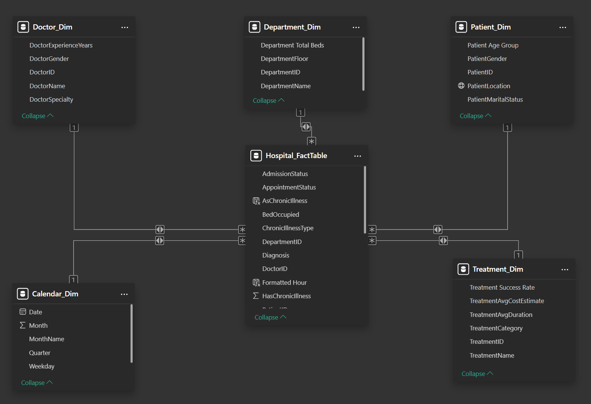
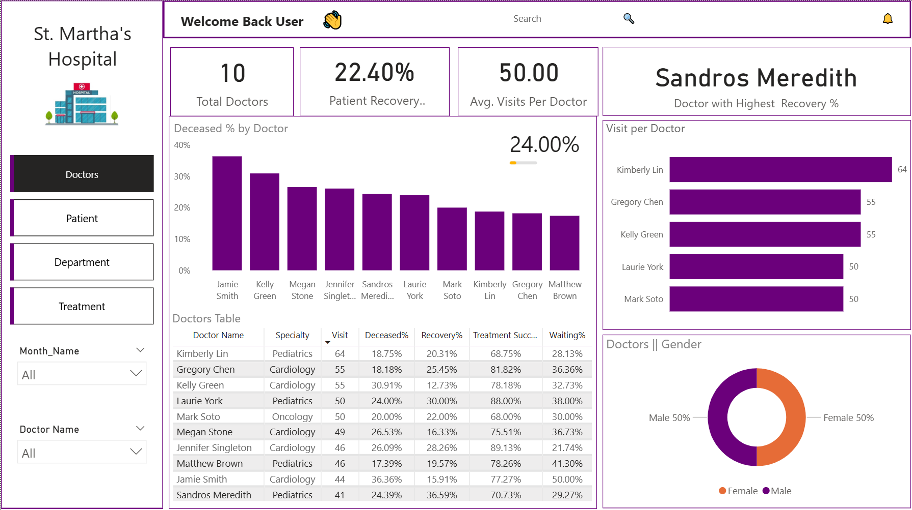
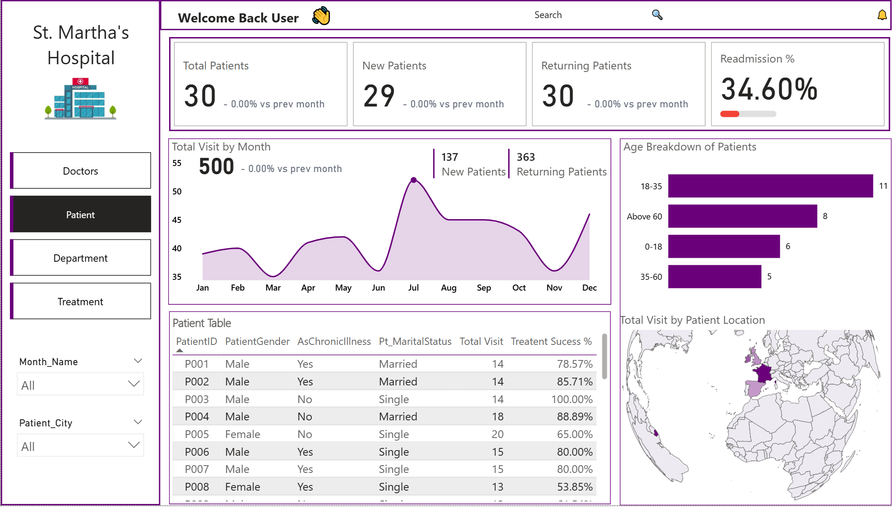

# Hospital_Management_&_Patients_Care_Analytics_with_PowerBI

  

---

## Business Overview
**St. Martha’s Hospital** is a reputable healthcare facility, providing high-quality care across its key specialties: **Oncology, Emergency, Cardiology, and Pediatrics.** The hospital is equipped with modern technology and staffed by experienced doctors, nurses, and healthcare professionals who collaborate to deliver safe, accurate, and timely care. 

St. Martha’s Hospital serves patients of all ages and is committed to clear communication, compassionate services, and coordinated care across all departments. The hospital focuses on meeting patients’ needs through dependable emergency services, advanced cancer treatment, specialized heart care, and dedicated pediatric support.

The hospital stands out for its strong clinical outcomes, professional staff, and patient-centred approach. By combining modern medical practices with a commitment to quality and community service, St. Martha’s Hospital remains a trusted and preferred healthcare provider in the region.

---

## Business Problem 

**St. Martha’s Hospital** currently stores all patient, doctor, department, and treatment information in a single Excel-based flat file. While functional for small datasets, this approach has become increasingly inefficient as patient transactions grow. Excel’s flat file structure cannot support the hospital’s analytical, operational, and scalability needs.

**Key issues include:**
1. **Scalability Limitations:** The growing volume of patient and treatment records causes slow performance, making data entry and reporting increasingly difficult.

2. **Poor Analytical Flexibility:** Identifying clinical trends (e.g., seasonal patterns, readmissions, departmental bottlenecks) requires complex manual calculations and often produces unreliable results.

3. **Lack of Data Organization:** Combining all entities in one table prevents clear relationships between patients, doctors, treatments, and departments.

4. **High Maintenance Overhead:** Manual updates increase the risk of errors, inconsistencies, and inefficiencies, ultimately compromising the reliability of hospital operational insights.

---

## Project Objectives
The primary objective of this project was to design a robust, scalable data model that enables accurate, efficient, and insight-driven healthcare analytics in Power BI. 

Specifically, this project aimed to:

- Restructure the hospital’s existing flat-file dataset into a **Power BI star schema,** supporting scalable, performant, and reliable analytics.
- Eliminate data redundancy and inconsistencies across patient visits by organizing data into well-defined **Fact and Dimension tables.**
- Establish clear, logical relationships between **Patients, Doctors, Departments, and Treatments,** enabling flexible slicing, filtering, and drill-down analysis in Power BI.
- Develop a clean, unified data model that enhances the hospital’s ability to analyze **operational performance and clinical trends.**
- Support the creation of **interactive Power BI dashboards and reports** that deliver clear insights into department activity, patient volumes, doctor workloads, and treatment utilization.
- Enable the definition, tracking, and monitoring of key performance indicators (KPIs), **including patient throughput, department efficiency, treatment frequency, readmission rates, and doctor performance, to support data-driven decision-making and improved operational outcomes.**

---

## Data Dictionary and Modelling
- **VisitID:** Unique identifier for each patient visit.
- **Patient ID:** Foreign key to patient details.
- **Doctor ID:** Foreign key to doctor's details.
- **Department ID:** Foreign key to department details.
- **Treatment ID:** Foreign key to treatment details.
- **Patient Visit Type:** New or Returning.
- **Admission Status:** Waiting, Admitted, or Discharged.
- **Appointment Status:** Completed, Cancelled, or No-show.
- **Visit Start Time, Visit End Time, Visit Duration Minutes:** Duration of visit.
- **Bed Occupied:** Whether a bed was used.
- **Visit Outcome:** Recovered, Referred, Ongoing, or Deceased.
- **Treatment Success:** Successful or Unsuccessful outcome.
- **Diagnosis:** Patient condition (Diabetes, Hypertension, Flu, Asthma).
- **Readmitted:** Flag if the patient was readmitted within 30 days of discharge.

  

---

## Approach & Methodology
This project followed a structured analytics and data modeling approach to transform raw hospital data into a reliable, scalable, and insight-driven Power BI solution.

Tools & Techniques Used

1. **Power BI Desktop** for end-to-end dashboard development and data visualization.

2. **Power Query** for data ingestion, cleansing, transformation, and normalization.

3. **DAX (Data Analysis Expressions)** to define and calculate key performance indicators (KPIs) and analytical measures.

4. **Star Schema Data Modeling** to ensure a scalable, performant, and analytics-ready data structure.

5. **Interactive Visuals** including slicers, cards, matrices, tables, parameters, maps, and charts to enable dynamic exploration and filtering of data.

6. **Data Analysis & Insight Generation** to identify trends, performance gaps, and actionable recommendations for operational and clinical decision-making.

>*⚠️ Note: This dataset is fictional and intended for educational and portfolio purposes only. No real patient data is used.*

---

## 🔗View the Live Dashboard
You can interact with the fully published Power BI dashboard here: 🔗 [View on PowerBI Service](https://app.powerbi.com/view?r=eyJrIjoiMjY2NTU1ZjUtYTFlNy00NWVmLWI5OWEtZTEyMWZmMDM1ZTk3IiwidCI6ImZmMGYzZTNhLTNlNTMtNDU0Zi1iMmI1LTZjNjg3NTNiOGVlNCJ9)
>*(Best viewed on desktop for full functionality. Ensure pop-ups are allowed.)*

---

## Doctor Analysis & Insight

  

**Key Metrics**
- 10 Total Doctors analyzed across multiple specialties
- 22.40% Average Patient Recovery Rate across the facility
- 50 Average Visits per Doctor, indicating balanced patient distribution
- Sandro Meredith was identified as the doctor with the highest recovery %

**Gender Distribution**
- Equal representation: 50% Male and 50% Female doctors, indicating a diverse and inclusive workforce

**Table-Level Findings**
- Highest Treatment Success:
  - Jennifer Singleton (Cardiology) – 89.13% and Laurie York (Pediatrics) – 88.00%

- Lowest Recovery %:
  - Kelly Green – 12.73% (possible indicator of case severity or data anomaly)

- Specialty Trends:
  - Cardiology shows both high visit counts and mortality rates, indicating a need for deeper review.

**Performance Insights**
- Mortality (Deceased %) varies significantly, with some doctors reaching close to 35%, indicating potential process or case complexity issues
- Jamie Smith and Kelly Green show the highest deceased percentages, requiring further evaluation
- Pediatrics and Cardiology dominate visit counts, suggesting high patient load in these specialties
- **It is important to mention that no doctor specializes in emergency**

## Patient Analysis & Insight

  

**Patient Demographics & Volume**
- St.Martha’s Hospital recorded 30 patients, with the largest age group being 18–35 years (11 patients)
- The 35–60 age group is the least represented (5 patients), suggesting potential engagement or access gaps among middle-aged adults
- As the population skews younger, this may influence service planning and targeted outreach

**Visit Activity & Care Continuity**
- Despite a small patient base, the hospital logged 500 total visits, indicating very high utilization
- Visits include 137 new visits and 363 returning visits, showing strong follow-up engagement and recurring care needs
- A 34.60% readmission rate is significantly high and suggests possible issues in:
  - Discharge planning
  - Chronic care management
  - Post-discharge follow-up protocols

**Geographic & Seasonal Insights**
- Most visits originate from France (245), followed by Ireland (137), the UK (64), and Spain (54). This reflects uneven regional reach and stronger adoption in France and Ireland
- Monthly trends show a mid-year peak in July, suggesting seasonal health needs or operational factors influencing patient volume.

## Department Analysis & Insight

  

**Department Performance**
- The facility operates a total of four departments with an overall 66.77% admission rate and 34.20% waiting caseload
- Pediatrics has the highest bed occupancy at 91.67%, indicating strong and sustained demand
- Cardiology follows with 88.57% occupancy, reflecting high patient load and potential wait-time pressures
- Emergency shows the lowest occupancy at 29%, suggesting faster patient turnover, shorter stays, or capacity higher than current demand

**Admission Volume**
- Admissions are evenly distributed across units, showing consistent patient demand: Oncology 131, Cardiology 128, Emergency 122, Pediatrics 119
- Differences in occupancy VS admissions highlight operational dynamics:
  - High Emergency admissions + low occupancy = rapid discharge and high efficiency
  - High Pediatrics occupancy + moderate admissions = longer stays or limited bed capacity

**Visit Timing & Operational Implications**
- Thursday and Friday experience the highest visit activity, with peak hours between 12 PM and 2 PM.
- These patterns support opportunities for:
  - Strategic staff scheduling
  - Reinforcing high-demand units like Pediatrics and Cardiology
  - Balancing load between departments to improve patient flow

## Treatment Analysis & Insight

  

**Key Metrics Overview**
- Average Treatment Cost: $683.33
- Average Treatment Duration: 48minutes
- Overall Treatment Success Rate: 77.40%
- Readmission Rate: 34.60%
- Chronic Illnesses Tracked: 4 major categories

**Treatment Insights**
- Six major treatments are offered across the hospital
- Chemotherapy has the highest success rate (84.88%), making it the strongest performer.
- MRI Scan (92 times) and ECG (90 times) are the most frequently performed procedures with success rates of 77.17% and 72.22%, respectively.

**Operational & Outcome Insights**
- Despite a strong overall success rate, the 34.60% readmission rate is significantly high, suggesting gaps in post-care or patient follow-up
- Chronic illness cases show mid-year spikes, which may be due to seasonal trends
- Variability in chronic illness frequency highlights the need for better long-term patient management.

---

## Business Recommendations

1. **Increase Treatment Success Rate**
- Standardize Best Practices: Encourage cross-departmental sharing of methods used by top-performing doctors like Sandros Meredith
- Clinical Audits: Review care protocols and outcomes monthly
- Patient Education: Enhance health education to lower readmissions
- Predictive Analytics: Use Power BI or AI models to flag high-risk patients for early intervention.

2. **Reduce Waiting Cases**
- Digital Queue Management: Implement patient scheduling and triage tools to distribute load efficiently
- Expand Capacity During Peak Hours: Staff more heavily between 10 AM–12 PM and on Thursdays/Fridays
- Fast-Track Low-Risk Patients: Streamline minor case handling through quick-care or telehealth.

3. **Optimize Department Utilization**
- Emergency Department Revamp: Investigate low occupancy, possibly due to underreporting, patient redirection, or staff shortage
- Resource Allocation: Redirect resources or personnel from high-occupancy departments during off-peak times
- Data-Driven Shifts: Use visit-by-hour trends to plan optimal staff schedules.

4. **Enhance Hospital Scalability & Credibility**
- Introduce KPIs Dashboards for Staff: Transparent performance tracking to foster accountability
- Benchmarking: Compare internal metrics (e.g., recovery%, readmission%) against national or provincial averages
- Digital Transformation: Adopt EHR (Electronic Health Records) integration for cleaner data and smoother reporting
- Public Transparency: Publish anonymized outcomes (successrates, patient satisfaction) to build public trust.

5. **Leverage Data Analytics for Continuous Improvement**
- Trend Analysis: Use historical patterns (like chronicillness peaks in July) to prepare seasonal campaigns
- Patient Segmentation: Analyze recovery rates by age, gender, and treatment type to personalize interventions
- Automate Alerts: Set up PowerBI alerts when KPIs exceed thresholds (e.g., readmission rate >30%).

### What Next

1. Enforce **role- and department-based access** with Row-Level Security (RLS).

2. Automate **scheduled data refresh** via Power BI Gateway for audit-ready reporting.

3. Integrate **patient feedback/survey** to deepen quality-of-care insights.

4. Enable **natural language Q&A** for rapid data exploration.

5. **Publish via Power BI Service** for secure, stakeholder-wide access.

---

## Conclusion
This PowerBI project provides a complete operational overview of St.Martha’s Hospital activities, helping management improve patient care and departmental performance.

The insights enable better resource allocation, data-driven planning, and improved healthcare outcomes. The hospital demonstrates strong treatment efficiency overall, but strategic improvements in aftercare and specific treatment processes can significantly enhance patient outcomes and operational performance.  

---

## Connect With Me
- 💼 **LinkedIn:** (https://www.linkedin.com/in/david-okeleye001/)
- 📧 **Email:** okeleyedavid2021@gmail.com
- 🌐 **Portfolio:** https://bit.ly/3N5c1p7
- 🐙 **GitHub:** https://github.com/olavidz01-dev
