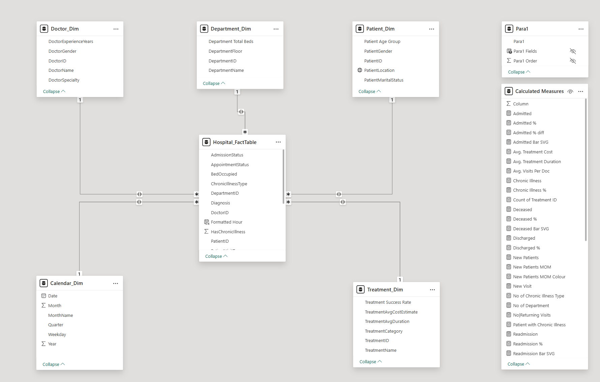

# Hospital_Management_Patients_Care_Analytics_with_PowerBI

  

---

## Business Overview
**St. Martha’s Hospital** is a reputable healthcare facility, providing high-quality care across its key specialties: **Oncology, Emergency, Cardiology, and Pediatrics.** The hospital is equipped with modern technology and staffed by experienced doctors, nurses, and healthcare professionals who collaborate to deliver safe, accurate, and timely care. 

St. Martha’s Hospital serves patients of all ages and is committed to clear communication, compassionate services, and coordinated care across all departments. The hospital focuses on meeting patients’ needs through dependable emergency services, advanced cancer treatment, specialized heart care, and dedicated pediatric support.

The hospital stands out for its strong clinical outcomes, professional staff, and patient-centred approach. By combining modern medical practices with a commitment to quality and community service, St. Martha’s Hospital remains a trusted and preferred healthcare provider in the region.

---

## Business Problem 

**St. Martha’s Hospital** currently stores all patient, doctor, department, and treatment information in a single Excel-based flat file. While functional for small datasets, this approach has become increasingly inefficient as patient transactions grow. Excel’s flat file structure cannot support the hospital’s analytical, operational, and scalability needs.

**Key issues include:**
1. **Scalability Limitations:** The growing volume of patient and treatment records causes slow performance, making data entry and reporting increasingly difficult.

2. **Poor Analytical Flexibility:** Identifying clinical trends (e.g., seasonal patterns, readmissions, departmental bottlenecks) requires complex manual calculations and often produces unreliable results.

3. **Lack of Data Organization:** Combining all entities in one table prevents clear relationships between patients, doctors, treatments, and departments.

4. **High Maintenance Overhead:** Manual updates increase the risk of errors, inconsistencies, and inefficiencies, ultimately compromising the reliability of hospital operational insights.

---

## Project Objectives
The primary objective of this project was to design a robust, scalable data model that enables accurate, efficient, and insight-driven healthcare analytics in Power BI. 

Specifically, this project aimed to:

- Restructure the hospital’s existing flat-file dataset into a **Power BI star schema,** supporting scalable, performant, and reliable analytics.
- Eliminate data redundancy and inconsistencies across patient visits by organizing data into well-defined **Fact and Dimension tables.**
- Establish clear, logical relationships between **Patients, Doctors, Departments, and Treatments,** enabling flexible slicing, filtering, and drill-down analysis in Power BI.
- Develop a clean, unified data model that enhances the hospital’s ability to analyze **operational performance and clinical trends.**
- Support the creation of **interactive Power BI dashboards and reports** that deliver clear insights into department activity, patient volumes, doctor workloads, and treatment utilization.
- Enable the definition, tracking, and monitoring of key performance indicators (KPIs), **including patient throughput, department efficiency, treatment frequency, readmission rates, and doctor performance, to support data-driven decision-making and improved operational outcomes.**

---

## Data Dictionary and Modelling
- **VisitID:** Unique identifier for each patient visit.
- **Patient ID:** Foreign key to patient details.
- **Doctor ID:** Foreign key to doctor's details.
- **Department ID:** Foreign key to department details.
- **Treatment ID:** Foreign key to treatment details.
- **Patient Visit Type:** New or Returning.
- **Admission Status:** Waiting, Admitted, or Discharged.
- **Appointment Status:** Completed, Cancelled, or No-show.
- **Visit Start Time, Visit End Time, Visit Duration Minutes:** Duration of visit.
- **Bed Occupied:** Whether a bed was used.
- **Visit Outcome:** Recovered, Referred, Ongoing, or Deceased.
- **Treatment Success:** Successful or Unsuccessful outcome.
- **Diagnosis:** Patient condition (Diabetes, Hypertension, Flu, Asthma).
- **Readmitted:** Flag if the patient was readmitted within 30 days of discharge.

  

---

## Approach & Methodology
This project followed a structured analytics and data modeling approach to transform raw hospital data into a reliable, scalable, and insight-driven Power BI solution.

Tools & Techniques Used

1. **Power BI Desktop** for end-to-end dashboard development and data visualization.

2. **Power Query** for data ingestion, cleansing, transformation, and normalization.

3. **DAX (Data Analysis Expressions)** to define and calculate key performance indicators (KPIs) and analytical measures.

4. **Star Schema Data Modeling** to ensure a scalable, performant, and analytics-ready data structure.

5. **Interactive Visuals** including slicers, cards, matrices, tables, parameters, maps, and charts to enable dynamic exploration and filtering of data.

6. **Data Analysis & Insight Generation** to identify trends, performance gaps, and actionable recommendations for operational and clinical decision-making.

---

## 🔗View the Live Dashboard
You can interact with the fully published Power BI dashboard here:

🔗 [View on PowerBI Service](https://app.powerbi.com/view?r=eyJrIjoiMjY2NTU1ZjUtYTFlNy00NWVmLWI5OWEtZTEyMWZmMDM1ZTk3IiwidCI6ImZmMGYzZTNhLTNlNTMtNDU0Zi1iMmI1LTZjNjg3NTNiOGVlNCJ9)

| (Best viewed on desktop for full functionality. Ensure pop-ups are allowed.)

---

## 🔢 Customer Overview

  

### Top KPIs (Key Performance Indicators)
- Total Customers: 10,000
- Average Balance: $76,486
- Products per Customer: 1.53 on average
- Active Customers: 51.51%
- Median Credit Score: 652

### 📊 Customer Segmentation: Analysis & Insights
**1. By Location**
- France has 50% (5,014) of the total customers.
- Germany and Spain are almost equally represented (~25% each).

**2. By Age Group & Gender**
- Largest age segments:
   - 35–44: 3,981 customers
   - 25–34: 3,222 customers
- Younger segment (<25) is the smallest: only 457 customers
- Gender distribution is balanced across all age groups

**3. By Credit Score Band**
- Majority of customers have fair to poor credit:
   - Fair (580–669): 3,331 customers
   - Poor (<580): 2,362 customers
   - Good (670–739): 2,428 customers
- Only 655 customers have Excellent (800+) scores - just 6.5% of the base

**4. By Number of Products**
- Over 50% have only 1 product
  - 5,084 (1 product)
  - 4,590 (2 products)
- Very few are using 3+ products

**5. By Balance Band**
- High Balance (100k–150k): 3,830 customers
- Low Balance (<50k): 3,692 customers
- Medium (50k-100k): 1,509 customers
- Very High Balance (150k+): 969 customers
- Most balances are clustered at the extremes - either low or high, suggesting a bimodal distribution

### ⚠️ Key Challenges Identified
**1. Low Active Engagement**
- With only 51.51% active customers, nearly half of the customer base is disengaged or dormant.
  - This may contribute significantly to the 20.37% churn rate.

**2. Low Cross-Sell Penetration**
- Over 95% of customers have 1–2 products
  - Suggests missed opportunities for upselling/cross-selling additional financial services (loans, credit cards, investments, etc.)

**3. Weak Credit Quality**
- With a median credit score of 652 and 5,693 customers in Fair or Poor segments, the bank may be carrying higher credit risk.
  - Could impact loan default rates and profitability if not managed

---

## 📊 Churn & Risk Overview

  

### Top KPIs (Key Performance Indicators)
- Churn Rate: 20.37%
- No. of Customers churned: 2.037
- Churned Balance: $186M
- High-Risk Customers: 174
- High-Value Churn Rate: 24.98%
  - Key Risk: Nearly 25% of high-value customers churned, representing a significant financial loss and a priority focus area.

### 🌍 Churn by Location

| Country         | Churn Rate   | Churned Balance    | Key Insight                               |
|-----------------|--------------|--------------------|-------------------------------------------|
| **Germany**     |     32%      |       $97.9M       | Highest churn rate and balance loss       |
| **Spain**       |     17%      |       $29.9M       | Moderate churn, lower financial exposure  |
| **France**      |     16%      |       $57.7M       | Lower churn rate, but large value impact  |

⚠ Germany is a high-risk churn zone, both in terms of volume and financial value.

### Churn by Customer Type
**1. Active vs. Inactive**
- Inactive customers account for 65% of churn, which is only 48% of the base.
- Active customer churn rate = 35%, indicating even active users aren't fully engaged.

**Actionable Insight:** Inactivity is a major churn predictor. There is a need to consider stronger lifecycle management.

  

### Churn by Product Usage
| No. of Products    | Churn Rate    | No. of Churned     |
|--------------------|-------------- |--------------------|
|   1                |     28%       |        1,409       | 
|   2                |     8%        |        348         |
|   3                |     83%       |        220         | 
|   4                |     100%      |        60          |

Customers with only 1 product are the largest churn group (1,409 customers).

**Caution**

The dataset shows a 100% churn rate for customers with four products. On investigation, this segment has a very small sample size, and all instances are labelled as churned. This appears to be a dataset artifact rather than a realistic banking behavior, so insights from this segment should be interpreted with caution. Strategic focus should remain on 1–3 product customers, where both volume and churn impact are material.

### Churn by Age Group
| Age Group       | Churn Rate    | No. of Churned                        |
|-----------------|-------------- |---------------------------------------|
|   45-54         |     48%       |  Extremely high churn risk            |
|   55+           |     39%       |  Aging segment disengaging            |
|   35-44         |     18%       |  Moderate risk                        | 
|   <25           |     9%        |  Lower churn, oppourtunity to grow    |
|   25-34         |     8%        |   Best-performing segment             |

**Insight:** Mid-to-senior age customers are churning at 2-5x the rate of younger ones.

### Churn by Credit Score Band
| Credit Score Band       |  Churn Rate    |
|-------------------------|----------------|
|  Poor (<580)            |     22%        |
|  Fair (580-669)         |     21%        |
|  very Good (740-799)    |     21%        |
|  Excellent (800+)       |     20%        |
|  Good (670-739)         |     19%        |

**Insight:**

Churn is fairly consistent across credit bands, and no strong correlation between score and churn.

### Churn Balance by Risk Tier

| Risk Tier       |  Churned Balance  |
|-----------------|-------------------|
|  Medium         |     $106M         |
|  low            |     $79.4M        |
|  High           |     $0.2M         |

**Insight:**
- My analysis showed that customers at the highest churn risk tend to have lower balances, meaning they contribute less to direct financial loss.
- The majority of revenue loss actually comes from medium-risk, higher-value customers.
- This highlights the need for differentiated retention strategies.

---

## Financial Performance Summary

  

### KPIs Overview
- Total Customers: 10,000
- Churn Rate: 20.37% (2,037 customers churned)
- Average Retain Balance: $72,745
- Average Churn Balance: $91,109
- Total Balance: $765M
- Geographies: France, Germany, Spain

**Key Insights**
**1. High Churn Rate**
- A churn rate of 20.37% is relatively high, indicating a potential issue in customer retention.
- The average balance of churned customers ($91,109) is higher than that of retained customers ($72,745), suggesting that higher-value customers are churning.

**2. Geographical Distribution**
- Majority of customers are from:
  - France: 5,014 (50.1%)
  - Germany: 2,509 (25.1%)
  - Spain: 2,477 (24.8%)

However, a filtered drill-down shows:
- In Germany, customers under 25 years old, with medium churn risk, are notably present (96 customers).
- Within this filtered segment, gender is almost equally split: 41 males, 36 females.

**3. Age Group Analysis**
- Most customers fall into 35-44 and 25-34 age groups:
  - 35-44: 3,278 retained
  - 25-34: 2,972 retained

- However, <25 age group has the lowest retention (417) and churn (40) proportionally.
- Suggests younger customers are more likely to churn.

**4. Churn Risk Tiers**
- Within the Germany/<25/Medium Risk segment:
  - Most are in Medium Risk tier (77 out of 96).
  - Low (14) and High (5) are negligible.

---

## 🎯 Strategic Recommendations

A. **Customer Retention Strategy**

1. **Prioritize high-balance churners:**
   - Since churned customers have higher average balances, create retention campaigns targeting high-value customers.
   - Consider proactive outreach, loyalty rewards, or personalized financial advice.

2. **Develop targeted interventions for medium-risk segments:**
   - The largest risk category is medium. Launch "nudge" campaigns for this group to reduce the risk of escalation.
   - Examples: financial planning tools, regular check-ins, or premium service trials.

B. **Segment-Specific Strategies**

1. **Adults (45-54 age group) and Seniors (55+ age group)**
   - High churn and low retention indicate dissatisfaction or low engagement.
   - Actions:
     - Launch adults-focused products (e.g., retirement planning consultations, health savings-linked accounts, insurance bundles (health + life + critical illness)).
     - Improve digital engagement (mobile banking, in-app "easy mode" interface).

2. **Germany Segment**
   - Customers <25 in Germany are showing churn behavior.
   - Consider localized offers and customer engagement campaigns in Germany targeting this age group.

C. **Geographic Focus**
   - France has 50% of total customers – leverage this for upselling and cross-selling.
   - Spain and Germany: Evaluate marketing ROI and retention performance to determine if higher engagement is needed.

D. **Improve Churn Prediction & Early Warning**
   - Use the existing churn risk tiers to build a predictive churn model based on:
     - Age
     - Geography
     - Gender
     - Credit Score
     - Product usage
     - Balance trends
   - Focus on medium-risk segments and monitor any increase in early warning indicators.

E. **Financial Impact Monitoring**
   - Given that high churners have higher balances:
     - Quantify potential revenue loss from churn and build a business case for investing in retention programs.
     - Use dashboards to track CLV (Customer Lifetime Value) over time by segment.

### Next Steps

1. **Deep dive into churn drivers:** Survey churned customers, analyze product usage data.

2. **Build retention models:** Use machine learning (e.g., logistic regression, random forest) to predict churn risk.

3. **Refine segmentation:** Include behavioral data (transaction volume, complaints, digital activity).

4. **Test retention offers:** A/B test targeted campaigns for high-value and medium-risk customers.

5. **Monitor KPIs monthly:** Add trend charts for churn rate, NPS, and retention by geography and age.

---

🔗 [View the Live Dashboard](https://bit.ly/UnityBank_Customer_Churn_Risk)

## Executive Summary

This Power BI analytics solution provides Unity Bank with a comprehensive, data-driven view of its customer base, financial exposure, and churn risk. By leveraging the full capabilities of Power BI from data transformation to advanced DAX measures and interactive dashboards, the project delivers actionable insights that directly support customer retention, revenue protection, and risk mitigation efforts.

This analysis reveals that Unity Bank is facing a critical customer churn challenge, with over 20% of customers exiting and a disproportionately high churn among medium-risk and high-balance clients. Inactivity, low product penetration, and regional concentration (notably in Germany) emerge as leading indicators of churn. Additionally, the bank’s current churn risk tiering underestimates the risk posed by medium-tier customers, who account for the largest share of churned balance value.

The dashboards empower stakeholders to explore these dynamics through real-time, filterable views segmented by geography, age, credit score, product usage, and churn risk. This enables business leaders to move from reactive churn tracking to proactive customer engagement and risk prevention.

## Executive Recommendation

Unity Bank should implement a **targeted, data-driven customer retention strategy** focused on the following priorities:

1. **Prioritize Medium-Risk and High-Balance Customers**  
   - Proactively monitor and engage medium-risk customers, especially those with high balances, using early-warning signals from the dashboard.

2. **Reactivate Inactive Customers**  
   - Launch re-engagement campaigns and personalized offers for inactive users, who represent a large portion of churned customers.

3. **Increase Product Penetration to Reduce Churn**  
   - Design bundled product offerings and personalized cross-sell strategies to encourage customers with only one product to deepen their relationship with the bank.

4. **Localize Retention Strategies by Region**  
   - Tailor retention and service strategies for high-churn regions like Germany, where customer behavior significantly deviates from the rest of the portfolio.

5. **Refine Risk Scoring Models**  
   - Update churn risk models to reflect actual behavioral drivers found in the data, such as inactivity, single product ownership, and regional trends, to improve prediction accuracy.

By implementing these actions, Unity Bank can significantly reduce churn, improve customer lifetime value, and drive sustainable revenue growth through smarter, insight-led decisions.

---

## Disclaimer
This project is for portfolio and educational display only.

No content may be reused without permission.

---

## Connect With Me
- 💼 **LinkedIn:** (https://www.linkedin.com/in/david-okeleye001/)
- 📧 **Email:** okeleyedavid2021@gmail.com
- 🌐 **Portfolio:** https://bit.ly/3N5c1p7
- 🐙 **GitHub:** https://github.com/olavidz01-dev
